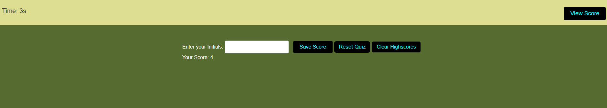

## Timed Quiz

 ## Deployed Link

 
# Table of Contents
- [Description](#description)
- [Task](#task)
- [User Story](#user-story)
- [Acceptance Criteria](#acceptance-criteria)
- [Usage](#usage)
- [Mock-Up](#Mock-up)
- [Questions](#questions)
- [License](#license)

## Description

This project is a timed coding quiz with multiple-choice questions, designed to help familiarize users with coding assessments often encountered during the journey to becoming a full-stack web developer. The quiz is built to run in the browser and features dynamically updated HTML and CSS powered by JavaScript code.

## Task
Your task is to implement a timed coding quiz with multiple-choice questions according to the provided user story and acceptance criteria. Ensure the application's functionality aligns with the provided mock-up and meets the grading requirements.

## User Story
AS A coding boot camp student
I WANT to take a timed quiz on JavaScript fundamentals that stores high scores
SO THAT I can gauge my progress compared to my peers.

## Acceptance Criteria
GIVEN I am taking a code quiz
WHEN I click the start button
THEN a timer starts and I am presented with a question
WHEN I answer a question
THEN I am presented with another question
WHEN I answer a question incorrectly
THEN time is subtracted from the clock
WHEN all questions are answered or the timer reaches 0
THEN the game is over
WHEN the game is over
THEN I can save my initials and my score

## Mock-Up
The project includes a mock-up demonstrating the application functionality.

## Usage
To use the quiz, simply open the deployed application URL in your browser and follow the instructions provided on the screen.

## License
This project is licensed under the MIT License.

## Questions

- **GitHub**: [daisy isibor](https://github.com/daisy isibor)
- **Email**: daisyisibor9@gmail.com

